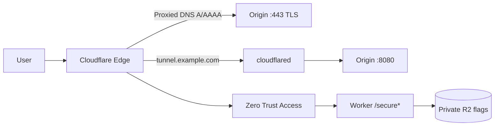

# Cloudflare SE Assignment — Setup Guide

This repository contains the **origin server**, **Cloudflare Worker**, and **configuration templates** for the Solutions Engineer technical project. You still need your own domain, Cloudflare account, and a host (VPS, cloud VM, etc.).

Replace every `example.com` with your domain.

## Architecture (high level)



## Prerequisites

- Domain on Cloudflare (Free plan is enough), nameservers active.
- A server with a public IP (or only tunnel after step 5).
- [Wrangler CLI](https://developers.cloudflare.com/workers/wrangler/) logged in: `npx wrangler login`.
- Optional: Google/GitHub IdP, or use **One-time PIN** in Zero Trust.

---

## Step 1 — Origin web server (HTTP headers echo)

On your origin host:

```bash
cd origin
python3 -m venv .venv
source .venv/bin/activate
pip install -r requirements.txt
gunicorn -b 127.0.0.1:8080 -w 2 app:app
```

Or with Docker:

```bash
cd origin
docker build -t se-origin .
docker run --rm -p 8080:8080 se-origin
```

Test locally:

```bash
curl -s -H "X-Demo: hello" http://127.0.0.1:8080/
```

You should see request headers (including `X-Demo`) in the body.

---

## Step 2 — Proxy through Cloudflare

1. In **DNS**, add an `A` (and/or `AAAA`) record for `@` or `www` pointing to your origin public IP.
2. Enable the **orange cloud** (Proxied).
3. **SSL/TLS** → Overview: set mode to **Full (strict)** only after step 3 is done.

---

## Step 3 — Origin TLS (non–Cloudflare certificate)

Cloudflare **Full (strict)** requires a valid certificate on the origin (not a Cloudflare origin CA unless you choose that path; the assignment asks for a **non–Cloudflare-provisioned** cert).

Typical approach with **nginx** + **Let's Encrypt**:

```bash
sudo apt install nginx certbot python3-certbot-nginx
sudo certbot --nginx -d example.com
```

Point nginx to your app:

```nginx
server {
    listen 443 ssl;
    server_name example.com;
    # ssl_certificate paths managed by certbot

    location / {
        proxy_pass http://127.0.0.1:8080;
        proxy_set_header Host $host;
        proxy_set_header X-Real-IP $remote_addr;
    }
}
```

Reload nginx, confirm `https://example.com` returns headers, then set Cloudflare SSL to **Full (strict)**.

---

## Step 4 — Rate limiting rule

In the dashboard: **Security** → **WAF** → **Rate limiting rules** (or **Rate rules** depending on UI).

Example rule to demo:

- **Expression**: `(http.host eq "example.com" and http.request.uri.path eq "/")`
- **Characteristics**: IP
- **Requests**: 5 per 10 seconds
- **Action**: Block (or Managed Challenge)

### How to demonstrate to a customer

1. Show the rule in the dashboard (scope, threshold, action).
2. Run a short loop from a terminal (same client IP):

   ```bash
   for i in $(seq 1 20); do
     curl -s -o /dev/null -w "%{http_code}\n" https://example.com/
   done
   ```

3. Open **Security** → **Events** (or Analytics) and filter for rate limit / block events; point out the spike and blocked requests.
4. Explain business value: protecting login/API endpoints from abuse, credential stuffing, or scrapers without changing origin code.

---

## Step 5 — Cloudflare Tunnel (`tunnel.example.com`)

On the origin host:

```bash
# Install cloudflared — see https://developers.cloudflare.com/cloudflare-one/connections/connect-networks/downloads/
cloudflared tunnel login
cloudflared tunnel create se-origin
cloudflared tunnel route dns se-origin tunnel.example.com
```

Copy `cloudflared/config.yml.example` to `/etc/cloudflared/config.yml`, set `tunnel` UUID and credentials path, and point `service` at `http://127.0.0.1:8080`.

```bash
sudo cloudflared service install
sudo systemctl enable --now cloudflared
```

In DNS, ensure `tunnel.example.com` is **Proxied** (orange cloud). Traffic to the origin can now use the tunnel instead of exposing port 8080 publicly.

---

## Step 6 — Zero Trust IdP

1. Go to [Cloudflare Zero Trust](https://one.dash.cloudflare.com/).
2. **Settings** → **Authentication** → add an IdP (Google, GitHub, etc.) or enable **One-time PIN**.
3. Complete the test login flow once so you know it works.

---

## Step 7 — Protect `/secure` on the tunnel hostname

**Access** → **Applications** → **Add an application** → **Self-hosted**:

- **Application domain**: `tunnel.example.com`
- **Path**: `/secure`
- **Identity providers**: your IdP (and/or OTP).

**Policies** (order matters):

1. **Allow** — Include: your email; or emails ending in `@cloudflare.com`.
2. **Block** (optional catch-all) — everyone else.

To reduce direct-to-IP bypass:

- After tunnel is working, **do not** publish the origin app on a public DNS name that skips Access.
- Run `scripts/origin-firewall-cloudflare-only.sh` on the origin so only Cloudflare can reach ports 80/443 (see step 8 in the brief).
- Prefer serving the app only on `127.0.0.1:8080` and exposing it via **tunnel** + **Access**, not a wide-open public port.

---

## Step 8 — Worker on `tunnel.example.com/secure`

From `worker/`:

```bash
npm install
# Edit wrangler.toml: account_id, PUBLIC_HOST=tunnel.example.com
npx wrangler r2 bucket create se-country-flags
npm run upload-flags
npx wrangler deploy
```

Attach a route (dashboard **Workers Routes** or in `wrangler.toml`):

- Pattern: `tunnel.example.com/secure*`
- Worker: `se-stand-deliver-secure`

Ensure **Access** still runs in front of the Worker (same hostname/path). The Worker reads:

- Email: `Cf-Access-Authenticated-User-Email`
- Country: `request.cf.country`
- Timestamp: generated at request time (ISO 8601)

Visit `https://tunnel.example.com/secure` after logging in via Access. The country code links to `/secure/US` (etc.) and serves SVG flags from **private R2** via the Worker binding only.

---

## Checklist before the panel

| Requirement | Verification |
|-------------|--------------|
| Headers on origin | `curl https://example.com` shows headers |
| Proxied + Full (strict) | SSL mode + valid origin cert |
| Rate limit | Loop curl + Security Events |
| Tunnel | `tunnel.example.com` resolves, tunnel healthy |
| Access on `/secure` | Incognito blocked; you and `@cloudflare.com` allowed |
| No IP bypass | Firewall / no public app port |
| Worker + R2 | HTML `/secure`, flag image on `/secure/XX` |
| Public Git repo | Push this repository |

---

## Presentation (PPT)

Use `docs/PRESENTATION_OUTLINE.md` as your slide deck source. Export to PDF/PPT for the recruiter.
